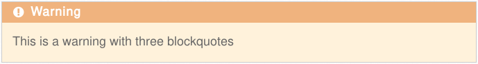
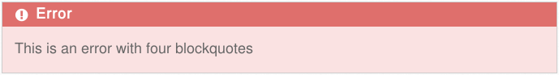
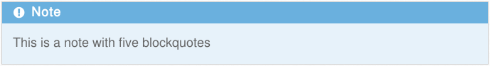

# Grav Blockquotes Plugin

`Blockquotes` is a [Grav][grav] Plugin that allows to transform nested
blockquotes into funny boxes for info, tips, warning or errors.

# Installation

To install this plugin, just download the zip version of this repository and
unzip it under `/your/site/grav/user/plugins`.
Then, rename the folder to `blockquotes`.

You should now have all the plugin files under

	/your/site/grav/user/plugins/blockquotes

# Usage for content authors

To use this plugin insert in any page the following blockquotes:

    >>> This is a warning with three blockquotes

    >>> This is an error with four blockquotes

    >>> This is a note with five blockquotes

    >>> This is a tip with six blockquotes

[grav]: http://github.com/getgrav/grav
